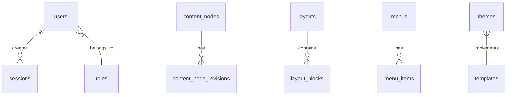

# VibeCMS Database Schema

## About This Document

**Purpose:** Authoritative table definitions and relationships. Every database interaction in the codebase must conform to this schema.

**Consistency requirements:** Data stores must match components defined in `architecture.md`; request and response fields in `api-spec.md` must trace to columns in these tables.

This document describes the complete structure of the VibeCMS database based on the GORM models in `internal/models`. It utilizes PostgreSQL's JSONB capabilities for flexible block-based data while maintaining strict relational integrity.

---

## Entity Relationship Diagram

---

## Core Infrastructure

### site_settings
Global configuration and external API keys.
- `key` (VARCHAR(100), PK)
- `value` (TEXT)
- `is_encrypted` (BOOLEAN)
- `updated_at` (TIMESTAMPTZ)

### extensions
Tracks installed extensions and their configuration.
- `id` (SERIAL, PK)
- `slug` (VARCHAR(100), UNIQUE)
- `version` (VARCHAR(50))
- `is_active` (BOOLEAN)
- `priority` (INT)
- `config` (JSONB)
- `created_at` / `updated_at` (TIMESTAMPTZ)

### themes
Manages installed themes and Git repositories.
- `id` (SERIAL, PK)
- `slug` (VARCHAR(100), UNIQUE)
- `name` (VARCHAR(200))
- `description` (TEXT)
- `version` (VARCHAR(50))
- `author` (VARCHAR(200))
- `source` (VARCHAR(20)) - upload, git
- `git_url`, `git_branch`, `git_token` (TEXT)
- `created_at` / `updated_at` (TIMESTAMPTZ)

---

## Authentication & Authorization

### users
Stores administrative accounts.
- `id` (SERIAL, PK)
- `email` (VARCHAR(255), UNIQUE)
- `password_hash` (VARCHAR(255))
- `role_id` (INT, FK -> roles)
- `language_id` (INT, FK -> languages)
- `full_name` (VARCHAR(100))
- `last_login_at` (TIMESTAMPTZ)
- `created_at` / `updated_at` (TIMESTAMPTZ)

### roles
Role-Based Access Control definitions.
- `id` (SERIAL, PK)
- `slug` (VARCHAR(50), UNIQUE)
- `name` (VARCHAR(100))
- `description` (TEXT)
- `is_system` (BOOLEAN)
- `capabilities` (JSONB) - Defines allowed CoreAPI permissions
- `created_at` / `updated_at` (TIMESTAMPTZ)

### sessions
Manages active administrative sessions.
- `id` (UUID, PK)
- `user_id` (INT, FK -> users)
- `token_hash` (VARCHAR(255), UNIQUE)
- `ip_address` (VARCHAR(45))
- `user_agent` (TEXT)
- `expires_at` (TIMESTAMPTZ)
- `created_at` (TIMESTAMPTZ)

---

## Content & Data

### content_nodes
Primary table for all routable entities.
- `id` (SERIAL, PK)
- `uuid` (UUID, UNIQUE)
- `parent_id` (INT, FK -> content_nodes)
- `node_type` (VARCHAR(50))
- `status` (VARCHAR(20))
- `language_code` (VARCHAR(10))
- `slug` (VARCHAR(255))
- `full_url` (TEXT, UNIQUE)
- `title` (VARCHAR(255))
- `blocks_data` (JSONB)
- `seo_settings` (JSONB)
- `translation_group_id` (UUID)
- `version` (INT)
- `published_at`, `created_at`, `updated_at`, `deleted_at` (TIMESTAMPTZ)

### content_node_revisions
Point-in-Time recovery snapshots for nodes.
- `id` (BIGSERIAL, PK)
- `node_id` (INT, FK -> content_nodes)
- `blocks_snapshot` (JSONB)
- `seo_snapshot` (JSONB)
- `created_by` (INT, FK -> users)
- `created_at` (TIMESTAMPTZ)

### node_types
Custom content schemas (e.g., Pages, Products).
- `id` (SERIAL, PK)
- `slug` (VARCHAR(50), UNIQUE)
- `label` (VARCHAR(100))
- `icon` (VARCHAR(50))
- `description` (TEXT)
- `field_schema` (JSONB)
- `url_prefixes` (JSONB)
- `created_at` / `updated_at` (TIMESTAMPTZ)

### languages
Multi-language support definitions.
- `id` (SERIAL, PK)
- `code` (VARCHAR(10), UNIQUE)
- `name` (VARCHAR(100))
- `is_default`, `is_active` (BOOLEAN)
- `created_at` / `updated_at` (TIMESTAMPTZ)

### media_files
Central asset library.
- `id` (UUID, PK)
- `filename` (VARCHAR(255))
- `mime_type` (VARCHAR(100))
- `path` (TEXT)
- `size` (BIGINT)
- `provider` (VARCHAR(20))
- `width`, `height` (INT)
- `created_at` (TIMESTAMPTZ)

### redirects
301/302 routing rules.
- `id` (SERIAL, PK)
- `old_url` (TEXT, UNIQUE)
- `new_url` (TEXT)
- `http_code` (INT)
- `created_at` (TIMESTAMPTZ)

---

## Layouts & Components

### layouts
Page layout configurations.
- `id` (SERIAL, PK)
- `name` (VARCHAR(100), UNIQUE)
- `description` (TEXT)
- `is_default` (BOOLEAN)
- `created_at` / `updated_at` (TIMESTAMPTZ)

### layout_blocks
Instances of blocks attached to a layout.
- `id` (SERIAL, PK)
- `layout_id` (INT, FK -> layouts)
- `block_type_id` (INT, FK -> block_types)
- `region` (VARCHAR(50))
- `sort_order` (INT)
- `settings` (JSONB)
- `created_at` / `updated_at` (TIMESTAMPTZ)

### block_types
Schema for reusable layout blocks.
- `id` (SERIAL, PK)
- `name` (VARCHAR(100), UNIQUE)
- `description` (TEXT)
- `icon` (VARCHAR(50))
- `is_system` (BOOLEAN)
- `schema` (JSONB)
- `created_at` / `updated_at` (TIMESTAMPTZ)

### templates
Pre-configured block arrangements for nodes.
- `id` (SERIAL, PK)
- `slug` (VARCHAR(50), UNIQUE)
- `label` (VARCHAR(100))
- `description` (TEXT)
- `block_config` (JSONB)
- `source` (VARCHAR(20))
- `theme_name` (VARCHAR(100))
- `created_at` / `updated_at` (TIMESTAMPTZ)

### menus & menu_items
Navigation trees.
- `id` (SERIAL, PK)
- `slug` (VARCHAR(50), UNIQUE)
- `name` (VARCHAR(100))
- `items` (JSONB) - Stored as a nested JSON structure for high performance
- `created_at` / `updated_at` (TIMESTAMPTZ)

---

## Systems & Communication

### email_logs
Audit trail for communications.
- `id` (UUID, PK)
- `recipient` (VARCHAR(255))
- `subject` (TEXT)
- `provider` (VARCHAR(20))
- `status` (VARCHAR(20))
- `created_at`, `sent_at` (TIMESTAMPTZ)

### email_rules & email_templates
Configuration for automated system emails.

### system_actions
Registry of background operations available to automation.
- `id` (SERIAL, PK)
- `slug` (VARCHAR(100), UNIQUE)
- `label` (VARCHAR(150))
- `category` (VARCHAR(50))
- `description` (TEXT)
- `payload_schema` (JSONB)
- `created_at` (TIMESTAMPTZ)